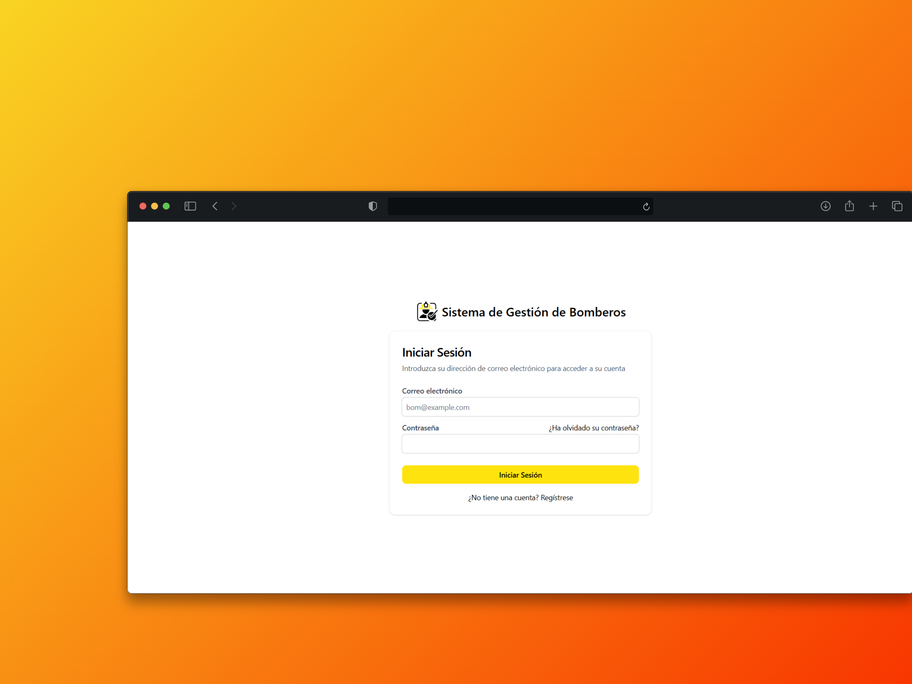
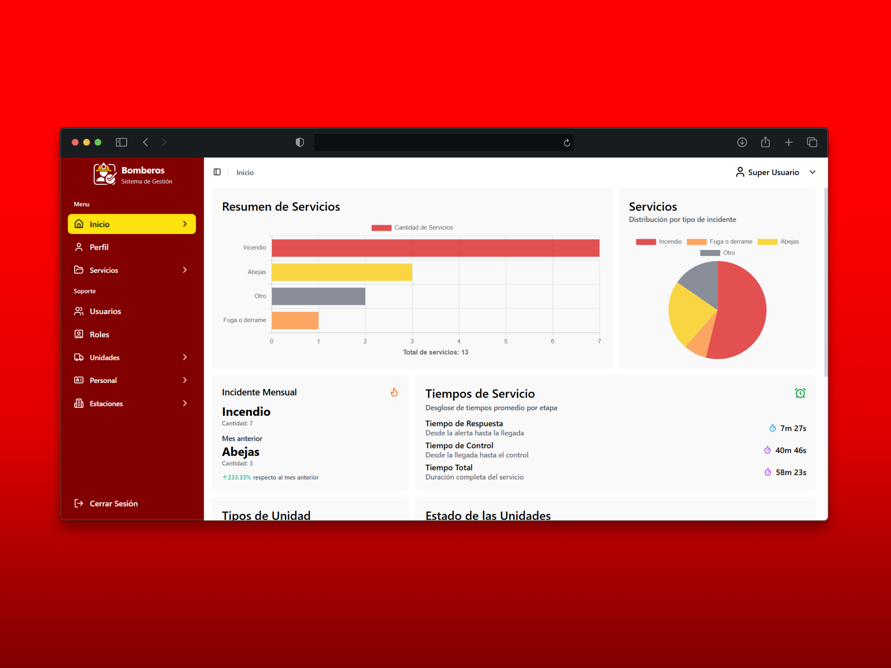
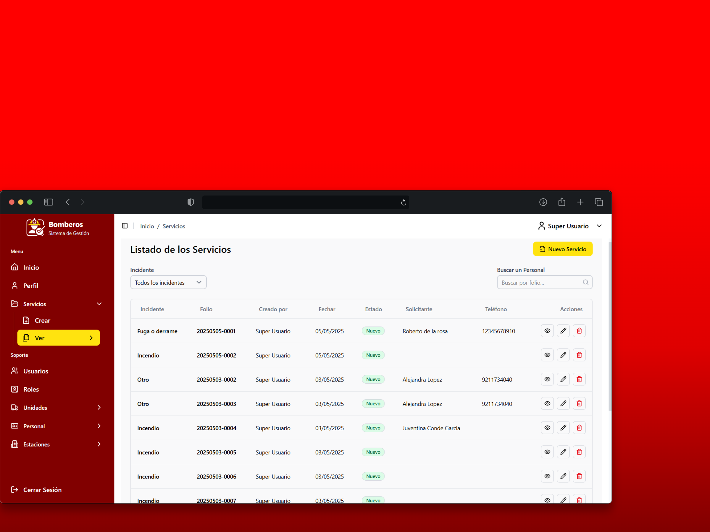
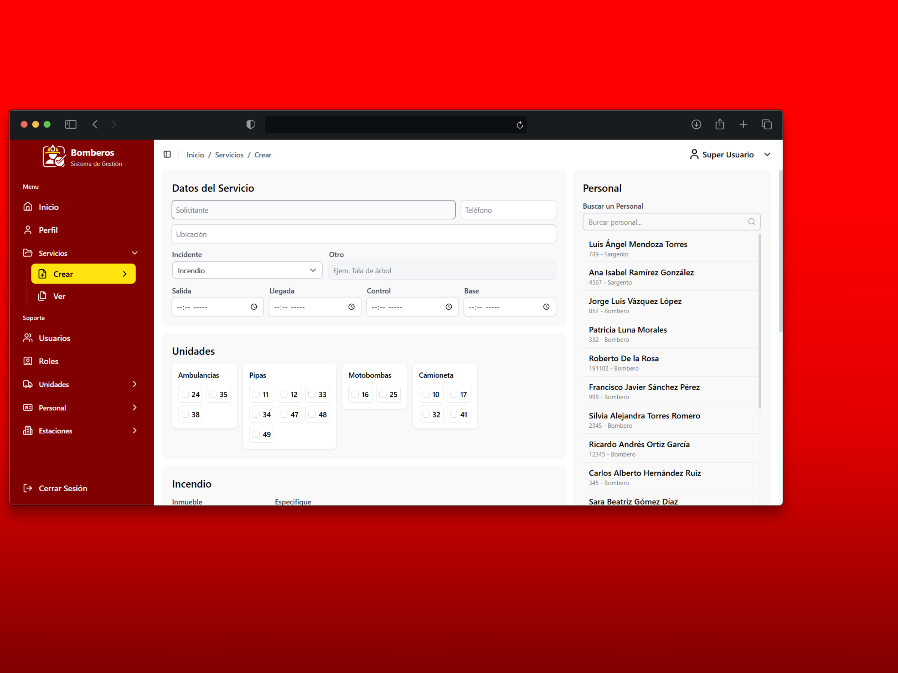
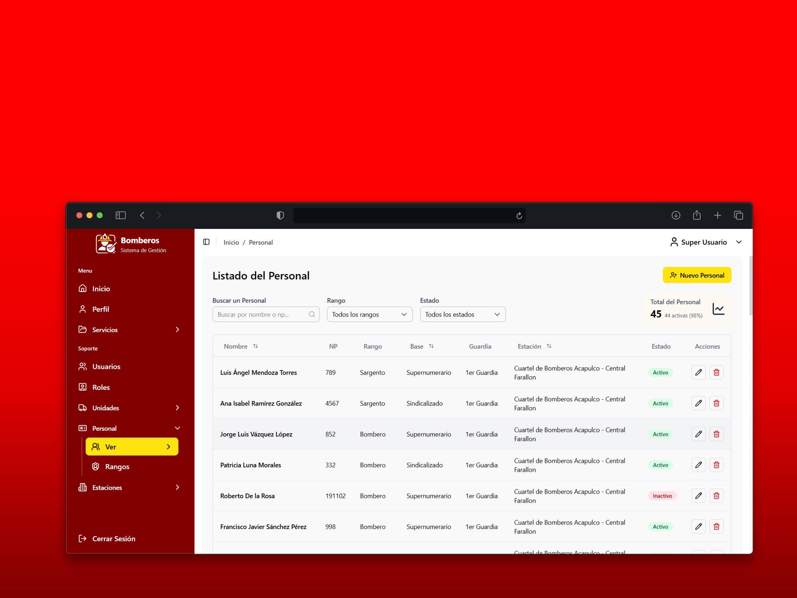
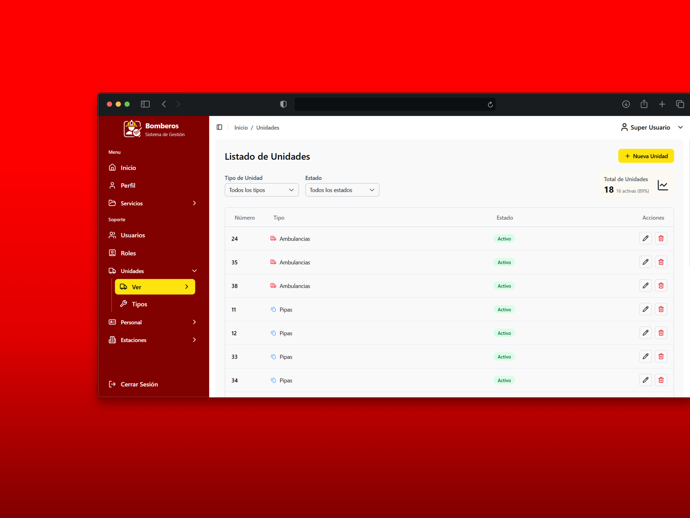

# Sistema de Gestión para Bomberos - SIS Bomberos

Sistema web desarrollado con React, TypeScript y Vite para la gestión de operaciones y recursos en estaciones de bomberos. Este proyecto forma parte del servicio social de [Tu Nombre] en [Nombre de la institución o dependencia].

<details>
<summary>Tabla de contenido</summary>

- [Sistema de Gestión para Bomberos - SIS Bomberos](#sistema-de-gestión-para-bomberos---sis-bomberos)
  - [🧩 Objetivo del Proyecto](#-objetivo-del-proyecto)
  - [⚙️ Tecnologías Utilizadas](#️-tecnologías-utilizadas)
  - [🏗️ Estructura del Proyecto](#️-estructura-del-proyecto)
  - [🚀 Instalación y Ejecución](#-instalación-y-ejecución)
      - [1. Clonar el repositorio:](#1-clonar-el-repositorio)
      - [2. Instalar dependencias:](#2-instalar-dependencias)
      - [3. Ejecutar la aplicación en modo desarrollo:](#3-ejecutar-la-aplicación-en-modo-desarrollo)
  - [📚 Funcionalidades Principales](#-funcionalidades-principales)
  - [📸 Capturas de Pantalla](#-capturas-de-pantalla)
      - [Página de Inicio de Sesión](#página-de-inicio-de-sesión)
      - [Página de Inicio](#página-de-inicio)
      - [Página del listado de los Servicios](#página-del-listado-de-los-servicios)
      - [Página para crear un Servicio](#página-para-crear-un-servicio)
      - [Página del listado del Personal](#página-del-listado-del-personal)
      - [Página del listado de las Unidades](#página-del-listado-de-las-unidades)
  - [👨‍💻 Autores](#-autores)

</details>

## 🧩 Objetivo del Proyecto

Diseñar e implementar una aplicación web que permita a las estaciones de bomberos gestionar eficientemente sus recursos, personal y operaciones, mejorando la respuesta ante emergencias y la administración interna.

## ⚙️ Tecnologías Utilizadas

- **React:** Biblioteca para la construcción de interfaces de usuario.
- **TypeScript:** Superset de JavaScript que añade tipado estático.
- **Vite:** Herramienta de desarrollo que ofrece un entorno rápido y moderno.
- **ESLint:** Herramienta para el análisis de código y mantenimiento de buenas prácticas.
- **Node.js:** Entorno de ejecución para JavaScript en el servidor.

## 🏗️ Estructura del Proyecto

```python
sis-bomberos-react/
├── public/ # Archivos públicos y estáticos
├── src/ # Código fuente de la aplicación
│ ├── components/ # Componentes reutilizables de React
│ ├── pages/ # Páginas principales de la aplicación
│ ├── services/ # Servicios y lógica de negocio
│ ├── App.tsx # Componente principal de la aplicación
│ └── main.tsx # Punto de entrada de la aplicación
├── package.json # Dependencias y scripts del proyecto
├── tsconfig.json # Configuración de TypeScript
└── vite.config.ts # Configuración de Vite
```

## 🚀 Instalación y Ejecución

#### 1. Clonar el repositorio:

```bash
git clone https://github.com/hrdelarosa/sis-bomberos-react.git
cd sis-bomberos-react
```

#### 2. Instalar dependencias:

```bash
npm install
```

#### 3. Ejecutar la aplicación en modo desarrollo:

```bash
npm run dev
```

La aplicación estará disponible en http://localhost:5173.

## 📚 Funcionalidades Principales

- Generación y consulta de reportes de servicios.
- Registro y gestión de personal de bomberos.
- Administración de equipos y recursos disponibles.\*\*\*\*
- Seguimiento de estadísticas.

## 📸 Capturas de Pantalla

#### Página de Inicio de Sesión

> **ℹ️ Descripción:** Formulario para iniciar sesión.



#### Página de Inicio

> **ℹ️ Descripción:** Vista principal de la aplicación donde se muestra el resumen/estadisticas de la apliación.



#### Página del listado de los Servicios

> **ℹ️ Descripción:** Listado de los servicios registrados, con opciones para crear, editar o eliminar ademas de ver los detalles del servicio.



#### Página para crear un Servicio

> **ℹ️ Descripción:** Formulario para registrar nuevos servicios atendidos por el personal de bomberos.



#### Página del listado del Personal

> **ℹ️ Descripción:** Listado del personal registrado, con opciones para crear, editar o eliminar.



#### Página del listado de las Unidades

> **ℹ️ Descripción:** Listado de las unidades registradas, con opciones para crear, editar o eliminar.



## 👨‍💻 Autores

Nombres: Hozmel Roberto De La Rosa Rendón - Jonas Jafert Salinas Aguilar

Correo electrónico: 20443301@uagro.mx

Institución: H. Ayuntamiento Constitucional de Acapulco de Juárez
